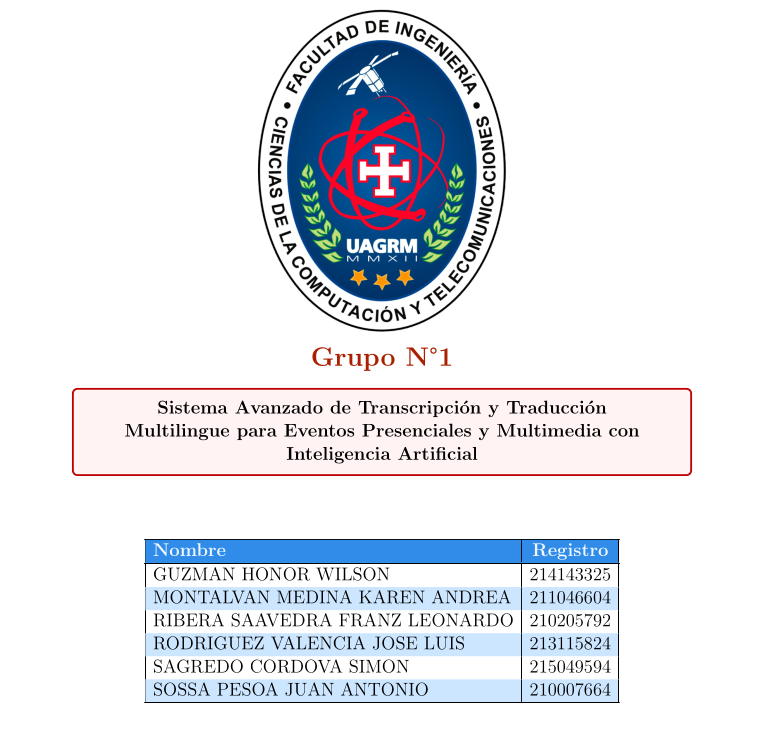

# Proyecto Transcripcion

<br/><br/>

# Estructura del proyecto
Descripción general de la estructura de carpetas y archivos del proyecto (puedes agregar más detalles según sea necesario).

# Herramientas
## Git & Github

A continuación se detallan los comandos básicos de Git para la gestión del código fuente y la interacción con GitHub.
1. **Inicializar el repositorio local** (solo la primera vez):

   ```bash
    git init

    git config --global user.email "tuemail@dominio.com"

    git config --global user.name "TuNombreDeUsuario"
  

    # Conectar tu repositorio local con GitHub, agregamos el repositorio remoto de GitHub (solo la primera vez).

    git remote add origin https://github.com/H4RSHAD/proyecto-transcripcion.git 
    ```
2. **Subir los cambios a Github**:
   ```bash
    # Actualizar la rama principal para traer los ultimos cambios antes de enviar los tuyos.
    git checkout master
    git pull origin master

    # Colaboradores: Trabajando con Ramas
    Es importante que los colaboradores trabajen en ramas separadas para evitar conflictos

    git checkout -b feature/historia-usuario     |  #Crear su rama para la historia de usuario asignada 
    
    git push -u origin feature/registrar-usuario | # Sube la rama al repositorio, la primera vez se usa -u origin para vincular el local con el remoto

    # Cada integrante trabaja en su rama y sube su avance a su misma rama
    git add .
    git commit -m "Implementación historia Usuario"
    git push          | # tu rama local queda vinculada a la rama remota, y ya no necesitarás especificarla cada vez.
    ```
3. **Mantener tu repositorio actualizado**:
    ```bash
    # Si otros colaboradores han hecho cambios en el repositorio, deberás actualizar tu copia local antes de poder subir tus propios cambios.
    
    git checkout master | # cambia a la rama master

    git pull origin master  | Traer los últimos cambios de la rama principal (master):

    git checkout feature/historia-usuario | #Cambia a tu rama de local o de trabajo

    git merge master | # integra los cambios de master en tu rama local

    ```
4. **Solo el master hace esto**:
    subir los cambios a la rama master del proyecto puedes hacerlo desde github, o trambien puede por comando
    ```bash
    git checkout master
    git pull origin master
    git merge feature/historia-usuario | #en la rama master se integra la historia de usuario asignada
    git push -u origin master
    ```